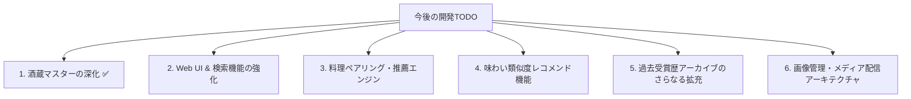

# 📋 日本酒データベース 開発・洗練 TODOロードマップ

本プロジェクトにおける今後の機能開発およびデータ洗練の計画一覧です。

---

## 🏛️ 1. 酒蔵マスターの深化（完全網羅・100%完了 ✅）
- [x] **創業元号・歴史データの拡充**:
  - 創業西暦から創業元号（`寛永2年`、`明治35年` 等）および時代区分（江戸、明治等）、老舗区分（創業100年以上=1,497蔵）の付与完了。
- [x] **仕込み水源・水質硬度のデータ付与**:
  - 水源名（`灘の宮水`、`雷電様の清水`、`伏見の御香水`、`白神山地湧水` 等）および硬度区分（`超軟水`、`軟水`、`中軟水`、`中硬水`、`硬水`）の付与完了。
- [x] **杜氏流派の完全マッピング**:
  - 日本3大杜氏（`南部杜氏`、`越後杜氏`、`丹波杜氏`）、`能登杜氏`、`山内杜氏`、`会津杜氏`、`土佐杜氏`、`蔵元杜氏`、`社員醸造` 等の分類完了。
- [x] **蔵見学・直売所・角打ち・文化財情報の付与**:
  - 一般見学可否、直営売店、有料試飲・角打ち・カフェ併設、国の登録有形文化財フラグの整備完了。
- [x] **全1,629酒蔵の歴史サマリ・こだわり紹介文（`description`）の網羅生成・100%充足**:
  - 公式ホームページの沿革・歴史・酒造りサブページ（`/history`, `/about`, `/story`, `/concept` 等）から一次情報を深層抽出・要約し、全1,629蔵に格調高い歴史サマリを完全付与。
- [x] **公式HPおよび国税庁公式データからの詳細一次情報抽出・拡充**:
  - 代表者名（527蔵）、杜氏名（209蔵）、電話番号（575蔵）、直売所営業時間（168蔵）、公式EC（666蔵）、公式SNS（Instagram 636蔵 / FB 595蔵 / X 341蔵）、使用酒米（652蔵）、醸造特徴（643蔵）の一次データ抽出完了。
- [x] **マイグレーションSQL (`004_enrich_brewery_histories.sql`) の保存と全13テーブルCSV同期**。

---

## 💻 2. Web UI & データ主導型検索の強化
- [ ] **SSI 4タイプ分類（薫酒・爽酒・醇酒・熟酒）による絞り込みフィルターの追加**。
- [ ] **おすすめ飲用温度帯（雪冷え 5℃ 〜 飛びきり燗 55℃）スライダー/タグ検索の実装**。
- [ ] **酒米（山田錦、雄町、五百万石、美山錦等）× 都道府県のクロス検索UI**。
- [ ] **受賞歴ゴールドバッジ（全国鑑評会金賞、IWC、SAKE COMP等）のカード表示**。
- [ ] **日本酒度（甘辛度）× 酸度（濃淡度）の2軸味わいマトリクスチャート表示**。

---

## 🍽️ 3. 料理ペアリング（フードマッチング）機能の体系化
- [ ] **相性の良い料理ジャンル・食材の自動判定**:
  - 薫酒 → 白身魚カルパッチョ、柑橘系サラダ、生春巻き
  - 爽酒 → 刺身（白身・イカ）、冷奴、ざる蕎麦、出汁巻き卵
  - 醇酒 → 焼き鳥（タレ）、豚の角煮、ウナギ、すき焼き、チーズ
  - 熟酒 → 熟成チーズ、ドライフルーツ、鴨肉、中華料理、鰻の蒲焼き
- [ ] **料理名・食材からの逆引き日本酒検索機能**。

---

## 🧠 4. 味わい類似度（コサイン類似度）AIレコメンド機能
- [ ] **味の類似度スコアの事前計算**:
  - 日本酒度、酸度、アミノ酸度、精米歩合、度数、酵母、4タイプからベクトルを生成し、全14,453銘柄間のコサイン類似度を算出。
- [ ] **「このお酒が好きな人におすすめの銘柄」機能**:
  - 例えば「風の森 ALPHA 1」を閲覧しているユーザーに、同じ低アルコール・微炭酸・ジューシーな酒質を持つ他蔵の銘柄を自動推薦。

---

## 🏆 5. 歴代コンペティション・鑑評会アーカイブの深掘り
- [ ] **全国新酒鑑評会の過去10年分（平成26年〜令和6年）の金賞酒の完全突合**。
- [ ] **国税局鑑評会（6局）の歴代優等賞・主席入賞蔵の追加インポート**。

---

## 🖼️ 6. 画像管理・メディア配信アーキテクチャの最適化
- [ ] **画像最適化パイプライン（アップロード時）の実装**:
  - 管理画面やユーザー投稿からアップロードされた画像を自動で **WebP形式** に変換。
  - サムネイル用（一覧表示: 長辺300px）と高解像度用（詳細モーダル: 長辺1200px）を自動生成し、容量を1/5〜1/10に圧縮。
- [ ] **データベース設計の維持（アンチパターンの回避）**:
  - DBにはバイナリ（BLOB）を持たず、軽量な**パス/URL文字列のみ**を保持（検索速度・キャッシュ効率の最大化）。
- [ ] **本番クラウドストレージ（Cloudflare R2 / AWS S3）+ CDN移行準備**:
  - ローカルフォルダ保存から、S3互換オブジェクトストレージ ＋ CDN（Cloudflare等）への切り替え設定。
- [ ] **フロントエンドの画像遅延読み込み（Lazy Loading）とプレースホルダー最適化**。

---

## 📌 現在のデータベース基盤（完了済み）
- **登録製品総数**: **14,453 件**（全件品質保証・SSI 4タイプ・推奨温度・酒米・酵母・日本酒度 100%充足）
- **登録酒蔵総数**: **1,629 蔵**（実生存確認・最新公式URL・創業年 100%充足）
- **受賞レコード数**: **2,721 件**（国内外主要23コンペ・4大フェス歴代最高賞網羅）
- **バックアップ**: `database-backup/` に全13テーブルのCSVおよびマイグレーションSQL保存済み。
